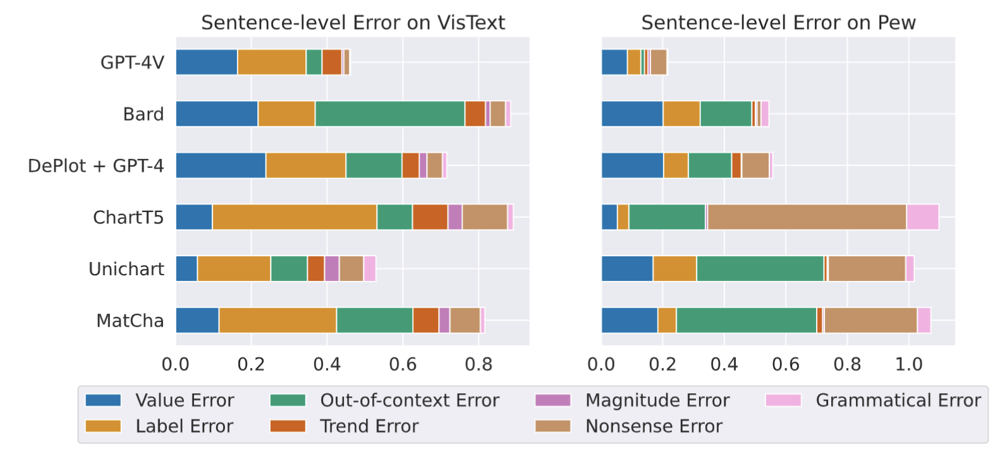

# Do LVLMs Understand Charts? Analyzing and Correcting Factual Errors in Chart Captioning 

<div align="center">
<a href="https://khuangaf.github.io/">Kung-Hsiang Huang</a>†, Mingyang Zhou*, Hou Pong Chan‡,
Yi R. Fung†, Zhenhailong Wang†, Lingyu Zhang*, Shih-Fu Chang*, Heng Ji†

</div>
<div align="center">
<strong>University of Illinois Urbana-Champaign†</strong>

<strong>Columbia University*</strong>
<strong>University of Macau‡</strong>
</div>

<div align="center">
<hr>
</div>

This repository holds the CHOCOLATE benchmark, which is used for assessing the factuality of chart captioning systems. The dataset includes an error analysis for six different models on two distinct datasets. These includes:

* LVLM: GPT-4V, Bard (before Gemini)
* LLM-based Pipeline: DePlot + GPT-4
* Fine-tuned Model: ChartT5, MatCha, UniChart

Annotations are conducted on the VisText and Chart-to-Text (pew split) datasets. This ensures a wide range of data and types of factual errors.

Results are shown in the below figure and table. We found that all captioning models often generate captions that are factually inconsistent with the input chart. In fact, even for highly capable **LVLMs, their non-factual rate is a whopping 81.27%**.



<div align="center">
<table>
  <tr>
    <th style="font-weight: bold;"></th>
    <th style="font-weight: bold;" colspan="2">CHOCOLATE-LVLM</th>
    <th style="font-weight: bold;" colspan="2">CHOCOLATE-LLM</th>
    <th style="font-weight: bold;" colspan="2">CHOCOLATE-FT</th>
  </tr>
  <tr>
    <td></td>
    <td># Factual</td>
    <td># Non-factual</td>
    <td># Factual</td>
    <td># Non-factual</td>
    <td># Factual</td>
    <td># Non-factual</td>
  </tr>
  <tr>
    <td>Sentence</td>
    <td>1,683</td>
    <td>1,270</td>
    <td>518</td>
    <td>469</td>
    <td>360</td>
    <td>1,023</td>
  </tr>
  <tr>
    <td>Caption</td>
    <td>74</td>
    <td>321</td>
    <td>27</td>
    <td>169</td>
    <td>112</td>
    <td>484</td>
  </tr>
</table>
</div>


## Spotlights

* CHOCOLATE - The first factuality benchmark for chart captioning.
* CHOCOLATE is also used to establish the Chart Caption Factual Error Correction task.
* Comming soon
    - [x] The CHOCOLATE benchmark
    - [x] The ChartVE metric ([khhuang/chartve](https://huggingface.co/khhuang/chartve))
    - [x] The Chart-To-Table model ([khhuang/chart-to-table](https://huggingface.co/khhuang/chart-to-table))
    - [ ] Scripts for table-based error correction 
    - [ ] Evaluation scripts
          

## The CHOCOLATE Benchmark 

We release the data for the CHOCOLATE benchmark at `data/chocolate.json`.

### Data Structure

Each instance in the json file corresponds to an annotation for a generated caption. Below, we illustrate the fields within each instance:

* **sentences**: A list of caption sentences.
* **labels**: A list of list, where the outer list correspond to sentence and the inner list corresponds to the errors within each sentence.
* **model**: A string that represents the model producing the caption.
* **dataset**: A string that represents which dataset the chart was sampled from.
* **image_path**: An URL to the chart image.
* **_id**: A unique identifier for this instance.

## ChartVE


ChartVE is a visual entailment model for evaluating the factuality of a generated caption sentence with regard to the input chart. The model takes in a chart figure and a caption sentence as input, and outputs an entailment probability. The underlying architecture of this model is UniChart.

Note that this model expects a caption sentence as textual inputs. For captions that are longer than one sentences, one should split the caption into multiple sentences, feed individual sentences to ChartVE, and then aggregate the scores. Below, we provide an example of how to use ChartVE.

```python
from transformers import DonutProcessor, VisionEncoderDecoderModel
from PIL import Image

model_name = "khhuang/chartve"
model = VisionEncoderDecoderModel.from_pretrained(model_name).cuda()
processor = DonutProcessor.from_pretrained(model_name)

image_path = "PATH_TO_IMAGE"

def format_query(sentence):
    return f"Does the image entails this statement: \"{sentence}\"?"

# Format text inputs
CAPTION_SENTENCE = "The state that has the highest number of population is California."
query = format_query(CAPTION_SENTENCE)

# Encode chart figure and tokenize text
img = Image.open(IMAGE_PATH)
pixel_values = processor(img.convert("RGB"), random_padding=False, return_tensors="pt").pixel_values
pixel_values = pixel_values.cuda()
decoder_input_ids = processor.tokenizer(query, add_special_tokens=False, return_tensors="pt", max_length=510).input_ids.cuda()


outputs = model(pixel_values, decoder_input_ids=decoder_input_ids)

# positive_logit = outputs['logits'].squeeze()[-1,49922]
# negative_logit = outputs['logits'].squeeze()[-1,2334] 

# Probe the probability of generating "yes"
binary_entail_prob_positive = torch.nn.functional.softmax(outputs['logits'].squeeze()[-1,[2334, 49922]])[1].item()

# binary_entail_prob_positive corresponds to the computed probability that the chart entails the caption sentence.

```

## C2TFEC

The proposed C2TFEC framework consists of two components: chart-to-table conversion and table-based error rectification.

### Chart-To-Table 

The Chart-To-Table model ([khhuang/chart-to-table](https://huggingface.co/khhuang/chart-to-table)) is trained to convert a chart into a structured table. The generated tables use &&& to delimit rows and | to delimit columns. The underlying architecture of this model is UniChart. Below, we provide an example of how to use our Chart-To-Table model.


```python
from transformers import DonutProcessor, VisionEncoderDecoderModel
from PIL import Image

model_name = "khhuang/chart-to-table"
model = VisionEncoderDecoderModel.from_pretrained(model_name).cuda()
processor = DonutProcessor.from_pretrained(model_name)

image_path = "PATH_TO_IMAGE"

def format_query(sentence):
    return f"Does the image entails this statement: \"{sentence}\"?"

# Format text inputs

input_prompt = "<data_table_generation> <s_answer>"

# Encode chart figure and tokenize text
img = Image.open(IMAGE_PATH)
pixel_values = processor(img.convert("RGB"), random_padding=False, return_tensors="pt").pixel_values
pixel_values = pixel_values.cuda()
decoder_input_ids = processor.tokenizer(input_prompt, add_special_tokens=False, return_tensors="pt", max_length=510).input_ids.cuda()

# Generate a table
outputs = model.generate(
        pixel_values.to(device),
        decoder_input_ids=decoder_input_ids.to(device),
        max_length=model.decoder.config.max_position_embeddings,
        early_stopping=True,
        pad_token_id=processor.tokenizer.pad_token_id,
        eos_token_id=processor.tokenizer.eos_token_id,
        use_cache=True,
        num_beams=4,
        bad_words_ids=[[processor.tokenizer.unk_token_id]],
        return_dict_in_generate=True,
    )
    
sequence = processor.batch_decode(outputs.sequences)[0]
sequence = sequence.replace(processor.tokenizer.eos_token, "").replace(processor.tokenizer.pad_token, "")

# Extract the data table
extracted_table = sequence.split("<s_answer>")[1].strip()
```


## Citation
```
@misc{huang-etal-2023-do,
    title = "Do LVLMs Understand Charts? Analyzing and Correcting Factual Errors in Chart Captioning",
    author = "Huang, Kung-Hsiang  and
      Zhou, Mingyang and
      Chan, Hou Pong  and
      Fung, Yi R. and
      Wang, Zhenhailong and
      Zhang, Lingyu and
      Chang, Shih-Fu and
      Ji, Heng",
    year={2023},
    archivePrefix={arXiv},
    primaryClass={cs.CL}
}    
```

